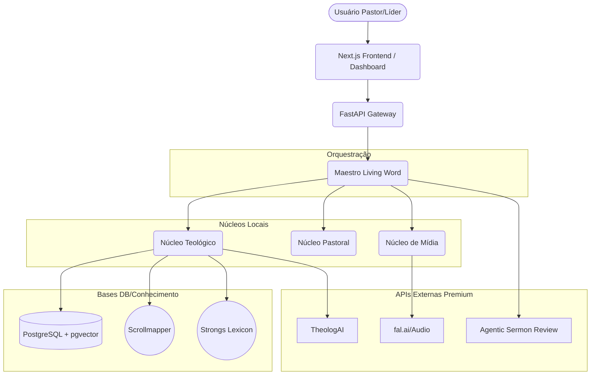

# ARQUITETURA MESTRE — LIVING WORD

Este documento consolida a arquitetura em 4 camadas para a plataforma Living Word, integrando a equipe de agentes já existente com bases de dados teológicas de alta fidelidade e módulos externos premium.

---

## PRINCÍPIO DIRETOR

Não substituímos a stack atual (Next.js, FastAPI, Supabase).
Construímos a arquitetura em 4 camadas:
1. **Orquestração e governança**
2. **Base teológica e dados**
3. **Motores de produção (Agentes)**
4. **Distribuição, SEO e produto**

Todos os módulos externos são incorporados como reforços especializados (banco de dados, pesquisa teológica, revisão de auditoria e geração de mídia).

---

## ARQUITETURA EM 4 CAMADAS

### CAMADA A: CEO / ORQUESTRADOR CENTRAL

**Maestro Living Word**
O agente principal e líder de governança. O Maestro não escreve sermões ou devocionais diretamente. Suas atribuições incluem:
- Atuar como roteador para decidir qual fluxo ativar.
- Definir os agentes que devem ser envolvidos.
- Escolher as bases de dados para consulta.
- Determinar o tipo de validação e checkpoint.
- Definir o canal de publicação/distribuição.

**Conselho Executivo (Subordinado ao Maestro)**
- **Guardião Teológico:** Garante a ausência de heresias e a devida fidelidade textual.
- **Hermeneutic Master:** Executa exegese profunda e aplicação prática.
- **Bibliographic Data Scientist:** Explora os repositórios, APIs e dados estruturados bíblicos.
- **Study Bible Compiler:** Organiza layouts paralelos, notas e referências cruzadas.
- **Radar do Rebanho:** Captura informações sobre o clima da igreja, notícias e tendências.
- **GEO Authority Agent:** Foca no SEO Generativo (Generative Engine Optimization).
- **Product Owner / PM:** Garante roadmap e evolução do hub.
- **Arquiteto de Software:** Zela pelas boas práticas da infra.

---

### CAMADA B: BASE DE DADOS E CONHECIMENTO

A fundação do Living Word. Evita a dependência exclusiva da memória volátil dos LLMs.

- **B1. Base Bíblica Estruturada (`scrollmapper/bible_databases`)**
  Repositório mestre contendo versões bíblicas em múltiplos formatos (SQLite, JSON, XML). Alimenta buscas diretas, APIs RAG e integrações canônicas.
- **B2. Base Lexical Original (`openscriptures/strongs`)**
  Dicionário XML e JSON de Strongs para análise aprofundada nos textos em hebraico e grego.
- **B3. Base Homilética Clássica (`spurgeon-gems`)**
  Base canônica legada (formato JSON) útil para repertório clássico, formatação editorial e citações em estudos.
- **B4. Base Consultiva Teológica (`TheologAI`)**
  Motor primário de pesquisa teológica externa. Oferece 8 traduções cruzadas, comentários clássicos, e até 18 documentos históricos.
- **B5. Base de Estudo Navegável (`kjvstudy.org`)**
  Apoio Interlinear via REST API para consulta rápida de grego/hebraico, índices e genealogias.
- **B6. MCP Bíblico (`bible-mcp`)**
  Model Context Protocol leve para buscas simples ou execução no modelo "freemium".

---

### CAMADA C: NÚCLEOS E AGENTES INTERNOS (SQUAD OF ELITE)

Estes compõem a força de trabalho executora especializada.

**C1. Núcleo Teológico**
Guardião Teológico, Hermeneutic Master, Bibliographic Data Scientist, Study Bible Compiler, Topical Journey Mapper.
*(Skills associadas: `ontology-cross-referencer`, `study-notes-generator`, `parallel-exegesis`, `canonical-indexer`)*

**C2. Núcleo Pastoral**
Radar do Rebanho (Coleta insights e clima local).

**C3. Núcleo de Crescimento e Vendas**
GEO Authority Agent, Local-Context pSEO Ingestor, O Lobo SDR 3.0, Playwright Auto-Poster.
*(Skills associadas: `programmatic-seo`, `beautiful-prose`, `apify-content-analytics`, `copywriting`)*

**C4. Núcleo de Produto e Engenharia**
Arquiteto de Software, Dev, DevOps, QA, UX Design Expert, AI/OX Master, PM/PO, Squad Creator.
*(Skills associadas: `design-orchestration`, `ui-skills`, `frontend-security-coder`)*

**C5. Núcleo de Automação, Mídia e Infraestrutura**
*(Skills associadas: integrações sociais (Insta/Twitter/LinkedIn), automação N8N/Make, pagamento (Stripe), design visual e AI áudio (`fal-audio`, `imagen`, etc.), infra segura (`postgresql`, `vulnerability-scanner`, MCPs).*

---

### CAMADA D: MÓDULOS EXTERNOS INCORPORADOS

- **D1. `Sermon-Assistant-AgenticWorkflow`**
  O "blueprint" definitivo do workflow. Controla as 3 camadas de CQ (Controle de Qualidade) e firewalls anti-alucinação.
- **D2. `agentic-sermon-review`**
  Camada de revisão independente. Age como auditoria crítica do Guardião Teológico para validação do roteiro e áudio antes da publicação.
- **D3. Ministério/Plataforma SaaS (`Ministry_Ai_Hub`)**
  Arquitetura espelho para o frontend (FastAPI + Next.js). Foca em Dashboard, doações e atendimento omnichannel do ministério.
- **D4. Processador de Áudio (`sermon-ai-audio-processor`)**
  Pipeline pós-culto que recorta, ajusta ganho, transcreve e sugere metadados/hashtags.
- **D5. Live Mode (`Rhema`)**
  Visão futura (Premium) para reconhecimento de referências bíblicas faladas em tempo real pelas lives/transmissões da igreja.

---

## STACK DE TECNOLOGIA E INFRAESTRUTURA TÉCNICA

- **Backend:** FastAPI (APIs Core), Deno/Supabase Edge Functions para orquestração leve.
- **Frontend / UX:** Next.js (App Router), React, TailwindCSS, focado no modelo Hub (`Ministry_Ai_Hub`).
- **Data Layer:** PostgreSQL transacional no Supabase.
- **Vetorização e RAG:** pgvector nativo.
- **Cache & Eventos:** Redis (Filas e background jobs).
- **Storage:** Supabase Storage ou S3 (Áudios, Pdfs de devocionais, imagens geradas).
- **Integrações de Agente:** MCP (Model Context Protocol), fal.ai (mídia gen), OpenAI/Anthropic/Gemini para LLMs.

